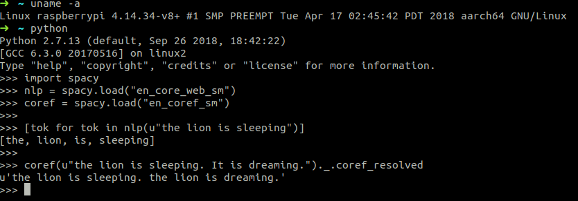
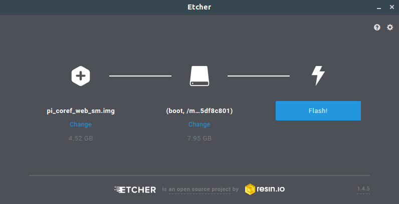

# spacy-raspberry

This is a 64bit Raspberry Pi image with spacy and neuralcoref pre-installed.

# requirements
- a raspberry pi 3 (tested with 3b+ 2017)
- a microSD ( > 8gb )

# installing
-  download the image in the release tab : [link](https://github.com/boehm-e/spacy-raspberry/releases/tag/1.0)
-  use Etcher to write the image to your microSD

